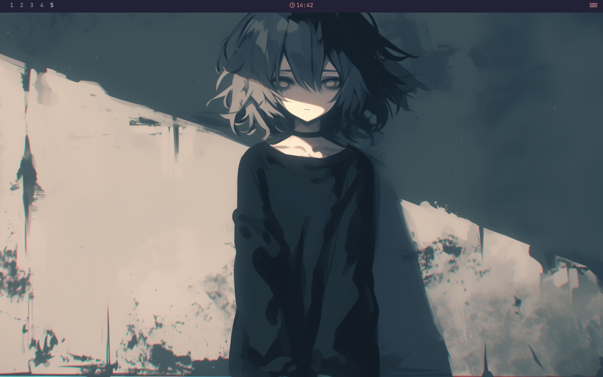
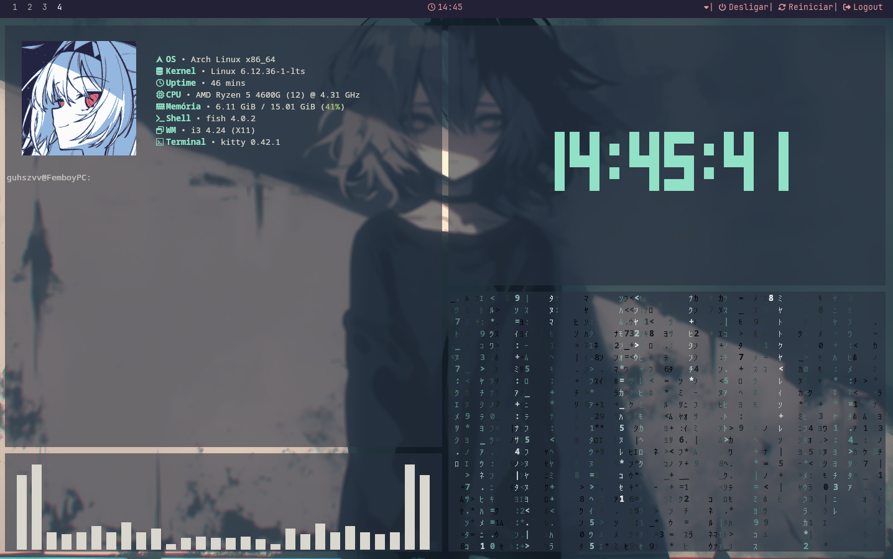

    <h1> ⤥ Femboy@PC dotfiles ⤦ </h1>
    <h3></h3>

> [!WARNING]
> This is my personal config. Everything's hard coded and not meant to work on a different machine.

<table align="center"><thead>
  <tr>
    <th>Shell</th>
    <th>WM</th>
    <th>Editor</th>
    <th>Terminal</th>
    <th>File Manager</th>
    <th>Session Manager</th>
  </tr></thead>
<tbody>
  <tr>
    <td>Fish</td>
    <td>I3</td>
    <td>VSCodium</td>
    <td>Kitty</td>
    <td>Thunar</td>
    <td><a href="https://github.com/uiriansan/SilentSDDM">SilentSDDM</a></td>
  </tr>
</tbody>
</table>

    <h2>• screenshots •</h2>

    
    

